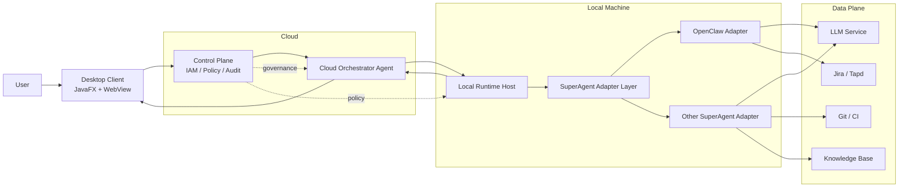

# 企业内部研发助手客户端架构方案（V2.0）

## 1. 概述与设计目标

本方案用于构建业界领先的企业内部研发助手客户端，参考 opencode、ClaudeCode、Codex、Manus 等客户端的架构实践，在企业可控、安全合规前提下实现多 SuperAgent 协同。

核心目标：
1. 打造统一研发入口，覆盖代码生成、代码审查、测试触发、项目管理、知识问答。
2. 以 Java 为主技术栈建设桌面客户端与控制能力，确保企业工程可控。
3. 支持多 SuperAgent 接入，并通过编排层统一路由、治理与审计。
4. 保持“云编排 + 本地执行”的拓扑，兼顾智能调度与本地数据安全。

## 2. 关键架构决策（冻结）

### 2.1 技术栈冻结
1. Java: 17
2. Gradle: 7.5.1
3. Kotlin: 1.9.22（辅助）
4. JavaFX Plugin: 0.1.0
5. JLink Plugin: 2.26.0
6. Java 作为主要语言

### 2.2 架构冻结
1. 任务编排 Agent 云端优先，V1 默认启用。
2. 执行拓扑采用“云编排 + 本地执行”。
3. 多 SuperAgent 统一通过标准适配层接入。
4. 路由策略采用能力路由（Capability-based Routing）。
5. 失败策略采用自动降级到备选 Agent。
6. 上下文权威由编排 Agent 统一持有并最小化下发。

### 2.3 OpenClaw 定位
1. OpenClaw 是首个生产接入的 SuperAgent 适配器。
2. OpenClaw 不是唯一智能体底座，后续可平滑接入其他 SuperAgent。

## 3. 总体架构与组件边界

### 3.0 总体架构图
本架构采用“云端编排 + 本地执行”模式：云端负责任务拆解、路由与治理，本地负责工具执行与代码操作。

图示说明：
1. 编排 Agent 是任务决策中枢，统一生成 `TaskGraph` 与 `RoutingDecision`。
2. Local Runtime Host 作为本地执行面，承接工具运行、审批执行与安全隔离。
3. SuperAgent 通过统一适配层接入，OpenClaw 是首个生产适配器，其他 SuperAgent 并行扩展。

### 3.1 组件
1. Desktop Client（JavaFX + WebView）
2. Cloud Orchestrator Agent（任务拆解、路由、回退、聚合）
3. Local Runtime Host（本地执行面，负责工具与子进程执行）
4. SuperAgent Adapter Layer（OpenClaw Adapter / Other Adapters）
5. Control Plane（IAM、策略、审计、配置、配额）
6. Data Plane（LLM、Jira/Tapd、Git/CI、知识库）

### 3.2 职责边界
1. 客户端负责交互展示、审批确认、会话入口。
2. 编排 Agent 负责任务图生成、路由决策与结果聚合。
3. 本地执行面负责真实工具执行与安全隔离。
4. 适配层负责屏蔽各 SuperAgent 差异并统一输出。
5. 控制面负责策略治理与合规审计。

## 4. 多 SuperAgent 编排架构

### 4.1 编排模型
1. 用户请求进入编排 Agent 后生成 `TaskGraph`。
2. 编排 Agent 基于 `AgentCapability` 进行能力匹配。
3. 生成 `RoutingDecision`（primary + fallback）。
4. 对每个任务节点下发 `ExecutionCommand` 至本地执行面。
5. 汇总 `ExecutionResult` 后输出统一结果。

### 4.2 标准适配层
所有 SuperAgent 必须实现统一 Adapter 契约：
1. `capabilities()`：声明能力与约束。
2. `health()`：健康检查。
3. `execute(command)`：执行标准命令。
4. 输出统一标准结果结构，便于编排层聚合与审计。

### 4.3 兼容与演进
1. 保留旧 `chat.send` 入口，内部映射为单节点任务图。
2. 新 Agent 接入不影响已有 Agent 路径。

## 5. 执行拓扑与任务流（云编排 + 本地执行）

### 5.1 拓扑原则
1. 云端负责“决策”，本地负责“执行”。
2. 云端不直接运行本地代码工具。
3. 本地执行默认受策略与审批控制。

### 5.2 典型任务流
1. 用户在客户端发起需求。
2. 请求进入编排 Agent，拆解为任务图。
3. 选定 primary Agent，并附带 fallback 列表。
4. 下发到本地执行面调用目标 SuperAgent。
5. 若失败，自动切换 fallback。
6. 编排层聚合结果并流式返回客户端。

## 6. 路由、降级与结果聚合

### 6.1 能力路由
决策因子：
1. 任务类型匹配度。
2. Agent 健康状态。
3. 历史成功率。
4. 延迟与成本画像。

### 6.2 自动降级
触发条件：
1. 超时
2. 执行错误
3. 结构化输出校验失败
4. 策略拒绝

降级规则：
1. 按 fallback 顺序自动切换。
2. 最多两级降级。
3. 降级耗尽后返回可解释失败结果。

### 6.3 聚合策略
1. 编排层统一合并多节点输出。
2. 代码结果按 patch 视图输出。
3. 输出附带来源 Agent 与 trace 信息。

## 7. 安全、权限与合规架构

### 7.1 安全原则
1. fail-closed：不满足策略即拒绝执行。
2. 高风险动作必须审批。
3. 无 policyTag 的执行命令默认拒绝。
4. 路由与降级决策全量审计。

### 7.2 权限模型
1. RBAC 控制功能使用权限。
2. 资源级权限控制项目/仓库/环境访问。
3. Agent Scope 控制可调用的 SuperAgent 范围。

### 7.3 数据分级与出域
1. L1：公开信息
2. L2：内部普通信息
3. L3：敏感代码与设计文档
4. L4：密钥与生产数据

规则：
1. L4 禁止出域。
2. L3 默认禁止外部模型，需显式授权 + 脱敏。
3. 上下文按最小必要原则下发。

## 8. 可观测性与治理架构

### 8.1 指标体系
1. 路由命中率（primary 命中）。
2. 降级触发率与降级成功率。
3. 各 SuperAgent 成功率、错误率、P95 延迟。
4. 审批积压与审批超时率。

### 8.2 审计体系
1. 记录每次路由决策与决策理由。
2. 记录每次降级触发与回退路径。
3. 统一 traceId 贯穿客户端、编排层、执行层。

### 8.3 SLO（架构目标）
1. 编排决策 P95 < 300ms（不含推理时延）。
2. 工具执行成功率 >= 98%。
3. 可降级任务的恢复成功率 >= 95%。

## 9. CI/CD 与发布架构

### 9.1 构建门禁
1. 单元测试 + 集成测试通过。
2. 协议兼容测试通过（旧入口与新编排接口）。
3. 安全测试通过（策略绕过、审批绕过、路径越界）。

### 9.2 发布策略
1. Windows 首发灰度。
2. 先灰度“仅 OpenClaw 路由”。
3. 再启用“多 SuperAgent 路由 + 自动降级”。
4. 提供一键回退到“仅 OpenClaw”模式。

## 10. 迁移与演进路线

1. 阶段 1：抽象 SuperAgent Adapter，封装 OpenClaw。
2. 阶段 2：上线编排 Agent，默认仅路由 OpenClaw。
3. 阶段 3：接入第二个 SuperAgent，开启能力路由与自动降级。
4. 阶段 4：全面启用多 SuperAgent 协作，保留单 Agent 应急回退。

## 11. 与详细设计文档的关系

1. 本文档定义架构边界与决策。
2. 字段级协议、状态机细节、接口示例以《企业内部研发助手客户端详细设计方案（V2.0）》为准。
3. 两份文档保持同一结论：多 SuperAgent、编排 Agent 默认启用、云编排本地执行。
