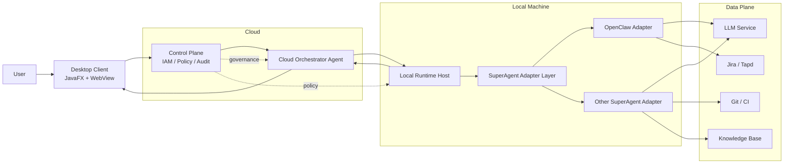
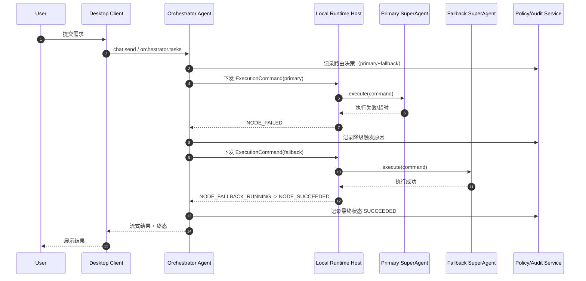

# 企业内部研发助手客户端详细设计方案（V2.0）

## 1. 文档目标与范围

### 1.1 目标
本方案用于构建业界领先的企业内部研发助手客户端，吸收 opencode、ClaudeCode、Codex、Manus 等客户端的架构实践，并在企业可控、安全合规前提下实现多 SuperAgent 协同。

### 1.2 范围
- 桌面客户端（JavaFX + WebView，Java 主语言）
- 云端任务编排 Agent（默认启用）
- 本地执行面（Local Runtime Host）
- 多 SuperAgent 接入（OpenClaw + 其他 SuperAgent）
- 企业控制面/数据面（权限、策略、审计、模型路由、集成服务）

### 1.3 不在范围
- iOS/Android 客户端
- 基础大模型训练平台
- 非研发流程自动化（如行政流程自动化）

### 1.4 业界对标原则
1. 对标 opencode：协议优先、工具调用结构化、可审计。
2. 对标 ClaudeCode：Agent 行为强约束、审批与安全优先。
3. 对标 Codex：研发闭环（代码、测试、Git、任务管理）深度整合。
4. 对标 Manus：复杂任务拆解与多 Agent 协作编排。
5. 本方案中 OpenClaw 是首个接入的 SuperAgent，但不是唯一智能体底座。

## 2. 关键决策（冻结）

### 2.1 技术栈冻结
1. Java: 17
2. Gradle: 7.5.1
3. Kotlin: 1.9.22（辅助）
4. JavaFX Plugin: 0.1.0
5. JLink Plugin: 2.26.0
6. 主工程语言：Java

### 2.2 架构冻结
1. 任务编排 Agent：云端优先，V1 默认启用。
2. 执行拓扑：云编排 + 本地执行。
3. 多 SuperAgent 统一通过标准适配层接入。
4. 路由策略：能力路由。
5. 失败策略：自动降级到备选 Agent。
6. 上下文权威：由编排 Agent 统一持有与裁剪。

### 2.3 V1 功能边界
1. 核心研发闭环：对话、代码改写、测试触发、Git/Jira 集成、审批审计。
2. 默认接入 OpenClaw + 至少一个额外 SuperAgent。
3. 首发平台：Windows 先行。

## 3. 逻辑架构与边界

### 3.0 总体架构图
该图用于实现导向：编排决策在云端，执行落在本地，SuperAgent 通过统一适配层接入。

图示说明：
1. `Cloud Orchestrator Agent` 是任务拆解、路由、降级与聚合中枢。
2. `Local Runtime Host` 是本地执行面，承接真实工具与代码执行。
3. `SuperAgent Adapter Layer` 对 OpenClaw 与其他 SuperAgent 做统一抽象。

### 3.1 核心组件
1. Desktop Client（JavaFX + WebView）
2. Cloud Orchestrator Agent（任务拆解、路由、聚合、回退）
3. Local Runtime Host（本地执行面，子进程与工具运行托管）
4. SuperAgent Adapter Layer（OpenClaw Adapter / Other Adapter）
5. Control Plane（IAM、策略、审计、配额、配置）
6. Data Plane（LLM、Jira/Tapd、Git/CI、知识库）

### 3.2 通信关系
1. Client -> Control Plane：`wss`（鉴权会话 + 流式事件）
2. Control Plane -> Orchestrator Agent：内网调用（鉴权）
3. Orchestrator Agent -> Local Runtime Host：安全通道（命令下发/状态回传）
4. Local Runtime Host -> SuperAgent 子进程：本机 IPC/loopback
5. SuperAgent -> Data Plane：按策略访问 LLM 与企业集成服务

### 3.3 编排与执行分离原则
1. 云端负责任务图生成与决策。
2. 本地负责代码与工具执行。
3. 云端不直接执行本地代码工具，避免越界与泄露风险。

## 4. 协议与接口详细设计

### 4.1 兼容入口（保留）
- `chat.send` 保持可用，内部映射为单节点 `TaskGraph` 执行。

### 4.2 编排接口（新增）
1. `POST /api/v1/orchestrator/tasks`
   - 提交任务根请求，生成 `taskId` 与 `TaskGraph`。
2. `POST /api/v1/orchestrator/tasks/{taskId}/events`
   - 本地执行面上报子任务事件。
3. `POST /api/v1/orchestrator/tasks/{taskId}/approve`
   - 审批决策（同意/拒绝/过期）。
4. `GET /api/v1/orchestrator/tasks/{taskId}/stream`
   - 任务流式状态、delta、工具事件。

### 4.3 关键类型（新增）
1. `TaskGraph`
   - 字段：`taskId`, `nodes[]`, `edges[]`, `timeoutMs`, `retryPolicy`。
2. `AgentCapability`
   - 字段：`agentId`, `capabilities[]`, `toolScopes[]`, `latencyClass`, `costClass`。
3. `RoutingDecision`
   - 字段：`primaryAgent`, `fallbackAgents[]`, `reason`, `policyTag`。
4. `ExecutionCommand`
   - 字段：`taskNodeId`, `targetAgent`, `inputSlice`, `policyTag`, `approvalRequired`。
5. `ExecutionResult`
   - 字段：`taskNodeId`, `state`, `output`, `errorCode`, `traceId`。

### 4.4 状态机
#### 4.4.1 主任务状态
- `PENDING`
- `RUNNING`
- `WAITING_APPROVAL`
- `SUCCEEDED`
- `FAILED`
- `CANCELED`
- `TIMEOUT`

#### 4.4.2 子任务扩展事件
- `NODE_RUNNING`
- `NODE_FALLBACK_RUNNING`
- `NODE_SUCCEEDED`
- `NODE_FAILED`
- `NODE_SKIPPED`

### 4.5 幂等与重试
1. 变更操作必须携带 `idempotencyKey`。
2. 去重键：`(userId, method, idempotencyKey)`。
3. 编排重试：指数退避，最多 3 次。
4. 回退链：`primary -> fallback[0] -> fallback[1]`，最多 2 级。

### 4.6 核心任务时序图（编排 + 回退）

时序说明：
1. 主任务状态通常从 `RUNNING` 进入 `SUCCEEDED` 或 `FAILED`。
2. 子任务在 primary 失败后进入 `NODE_FALLBACK_RUNNING`，成功后回到主任务 `SUCCEEDED`。
3. 路由决策、降级触发、最终终态均必须写入审计链路（traceId 关联）。

## 5. 多 SuperAgent 接入设计

### 5.1 接入标准
1. 所有 SuperAgent 必须实现统一 Adapter 接口：
   - `plan()`（可选）
   - `execute(ExecutionCommand)`
   - `health()`
   - `capabilities()`
2. Adapter 输出必须转换为统一 `ExecutionResult`。

### 5.2 OpenClaw 适配器
1. 作为首个生产适配器。
2. 通过本地子进程接入 OpenClaw Gateway/Agent。
3. 复用 OpenClaw Skills 与工具沙箱能力。

### 5.3 其他 SuperAgent 适配器
1. 采用同一 Adapter 契约接入。
2. 禁止绕过策略引擎直接访问本地工具。
3. 必须提供能力声明和健康探针。

## 6. 路由、降级与结果聚合

### 6.1 能力路由规则
1. 先按任务类型匹配能力标签。
2. 再按健康度、延迟、历史成功率、成本打分。
3. 选出 `primary + fallback`。

### 6.2 自动降级规则
1. 触发条件：超时、不可用、结构化输出非法、策略拒绝。
2. 降级动作：切换到下一个备选 Agent 自动重试。
3. 降级上限：2 次，超限返回可解释失败。

### 6.3 结果聚合
1. 编排 Agent 统一合并子任务结果。
2. 代码类结果按 patch 合并策略处理冲突。
3. 输出统一附带来源 Agent 与 trace 信息。

## 7. 安全与权限体系

### 7.1 安全基线
1. 默认 fail-closed：无策略标签拒绝执行。
2. 高风险操作进入审批态，审批超时自动取消。
3. 本地执行工具受命令白名单与路径白名单限制。
4. 敏感操作全量审计。

### 7.2 权限模型（RBAC + Agent Scope）
1. 角色控制功能权限（DEV/LEAD/PM/SRE/SEC_ADMIN）。
2. 资源控制项目、仓库、环境访问边界。
3. Agent Scope 控制用户可调用哪些 SuperAgent。

### 7.3 数据分级与出域
1. `L1` 公开、`L2` 内部普通、`L3` 敏感代码、`L4` 密钥与生产数据。
2. `L4` 禁止出域。
3. `L3` 默认禁止外部模型，需显式授权 + 脱敏。
4. 上下文下发遵循“最小必要原则”。

## 8. 可观测性与审计

### 8.1 指标
1. 路由命中率（primary 命中比例）。
2. 降级触发率与降级成功率。
3. 各 SuperAgent 成功率、P95 延迟、错误率。
4. 审批积压数与超时率。

### 8.2 日志与追踪
1. 所有路由决策写入审计日志。
2. 主任务与子任务共享 `traceId`。
3. 记录每次 Agent 选择、降级原因、最终结果。

### 8.3 SLO（V1）
1. 编排决策 P95 < 300ms（不含模型推理）。
2. 工具执行成功率 >= 98%。
3. 降级成功率（可降级任务）>= 95%。

## 9. CI/CD 与发布

### 9.1 构建门禁
1. 单元测试、集成测试通过。
2. 协议兼容测试通过（旧接口与新接口）。
3. 安全测试通过（策略绕过、越权、敏感路径访问）。

### 9.2 发布策略
1. Windows 首发灰度。
2. 先对 OpenClaw 单路由灰度，再启用多 Agent 路由。
3. 保留回滚开关：可退回“仅 OpenClaw”模式。

## 10. 测试计划与验收标准

### 10.1 功能用例
1. 多 Agent 路由到 primary 成功。
2. primary 失败后自动切 fallback 成功。
3. fallback 全部失败后返回可解释错误。
4. 旧 `chat.send` 兼容入口可用。

### 10.2 安全用例
1. 无 `policyTag` 执行命令被拒绝。
2. 高风险操作未审批无法执行。
3. 敏感目录访问拒绝并记录审计。

### 10.3 一致性用例
1. 编排状态与子任务状态一致。
2. 重复请求不重复执行。
3. 跨 Agent 上下文不漂移。

### 10.4 验收门槛
1. P0/P1 缺陷清零。
2. 审计链路完整率 100%。
3. 多 Agent 路由与降级核心场景全部通过。

## 11. 迁移策略（从 V1 单 Agent 到 V2 多 Agent）

1. 阶段 1：引入 Adapter 抽象，封装 OpenClaw 为统一接口。
2. 阶段 2：上线编排 Agent，但仅路由 OpenClaw（兼容验证）。
3. 阶段 3：接入第二个 SuperAgent，开启能力路由与自动降级。
4. 阶段 4：默认入口切为编排链路，保留单 Agent 降级模式。

## 12. 实施约束

1. 所有新增接口必须提供 OpenAPI/Schema。
2. 所有策略决策必须可审计、可追踪。
3. 任意写操作必须具备策略校验与审批链路。
4. 不满足策略时默认拒绝执行。
